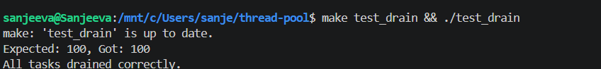
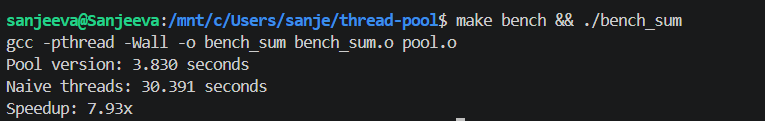

# Thread Pool Library in C
## Fixed-size worker pool with producer-consumer scheduling, graceful shutdown, and performance benchmark

A reusable thread pool library written in C using POSIX threads. The pool maintains a fixed number of worker threads that consume tasks from a thread-safe queue, eliminating the overhead of creating and destroying threads for every job. The implementation includes graceful shutdown that drains all pending tasks, and a CPU-bound benchmark that demonstrates a **7.93× speedup** over naive thread-per-task creation.

---

## Project Structure

```
thread-pool/
├── pool.h                  # Public API and data structures
├── pool.c                  # Core implementation (create, submit, destroy)
├── example.c               # Simple usage demo
├── test_drain.c            # Correctness test: proves graceful shutdown drains all tasks
├── bench_sum.c             # Performance benchmark: pool vs naive threads
├── Makefile                # Build all targets
├── screenshots/
│   ├── test_drain_output.png   # Proof: all tasks drained correctly
│   └── benchmark_output.png    # Proof: 7.93× speedup
├── .gitignore
└── README.md
```

---

## Quick Start

```bash
# Build everything
make

# Run correctness test (verifies graceful shutdown drains all tasks)
make test_drain && ./test_drain

# Run performance benchmark (measures speedup over thread-per-task)
make bench && ./bench_sum
```

---

## How It Works

### 1. Fixed-Size Worker Pool

The `pool_create` function spawns a fixed number of worker threads and stores them in an array. Each worker immediately begins waiting for tasks.

```c
thread_pool_t* pool_create(int num_threads) {
    // allocate pool structure and thread array
    // initialise mutex and condition variable
    for (int i = 0; i < num_threads; i++) {
        pthread_create(&pool->threads[i], NULL, worker, (void*)pool);
    }
    return pool;
}
```
---

### 2. Thread-Safe Task Queue

Tasks are submitted via `pool_submit`, which allocates a task node, appends it to the tail of a singly linked list, and signals one waiting worker. The entire queue operation is protected by a mutex, and the condition variable ensures workers sleep when the queue is empty – no busy-waiting.

```c
void pool_submit(thread_pool_t *pool, task_func func, void *arg) {
    // allocate and initialise task node
    pthread_mutex_lock(&pool->lock);
    // append to queue tail
    if (pool->task_tail == NULL) {
        pool->task_head = pool->task_tail = t;
    } else {
        pool->task_tail->next = t;
        pool->task_tail = t;
    }
    pthread_cond_signal(&pool->cond);
    pthread_mutex_unlock(&pool->lock);
}
```
---

### 3. Graceful Shutdown That Drains All Tasks

`pool_destroy` sets a stop flag, broadcasts to all workers, then joins every thread. Workers exit only after the queue is empty, guaranteeing that **all submitted tasks are executed** before the pool is freed. Any leftover tasks (impossible in the normal case) are also freed.

```c
void pool_destroy(thread_pool_t *pool) {
    pthread_mutex_lock(&pool->lock);
    pool->stop = 1;
    pthread_cond_broadcast(&pool->cond);
    pthread_mutex_unlock(&pool->lock);
    for (int i = 0; i < pool->num_threads; i++)
        pthread_join(pool->threads[i], NULL);
    // free remaining tasks and clean up
}
```

---

### 4. Performance Benchmark

`bench_sum.c` compares two approaches for executing 10,000 CPU-bound tasks (each summing an array of 1,000,000 integers):

- **Pool version** – 8 workers pull tasks from the queue and execute them.
- **Naive version** – creates and joins a brand-new thread for every single task.

The benchmark uses `clock_gettime` to measure wall-clock time and prints the speedup.

---

## Sample Execution

### Correctness: Graceful Shutdown Drains All Tasks



100 tasks are submitted, and `pool_destroy` is called immediately. The output confirms all 100 tasks were completed before the program exits – no `sleep()`, no manual waiting, just a real drain.

### Performance: 7.93× Speedup Over Naive Threads



```
Pool version: 3.830 seconds
Naive threads: 30.391 seconds
Speedup: 7.93x
```

On this workload, reusing 8 worker threads is nearly 8 times faster than spawning and destroying 10,000 threads individually.

*Benchmark environment: WSL2 (Ubuntu), Intel i5‑1135G7, 16 GB RAM.*

---

## Complexity

| Operation        | Complexity |
|------------------|------------|
| `pool_submit`    | O(1)       |
| `pool_destroy`   | O(n) where n = number of pending tasks |
| Task execution   | O(1) per worker dispatch |

---

## Why This Matters

A thread pool is one of the most common patterns in systems programming. This project demonstrates:

- Real synchronisation with mutexes and condition variables.
- Producer‑consumer scheduling without busy‑waiting.
- Safe resource management (no leaked threads, no dropped tasks on shutdown).
- A measurable, verifiable performance benefit over naive thread creation.

The same design can be integrated into an HTTP server, a database connection pool, or any application where fixed‑size concurrency is needed.
---